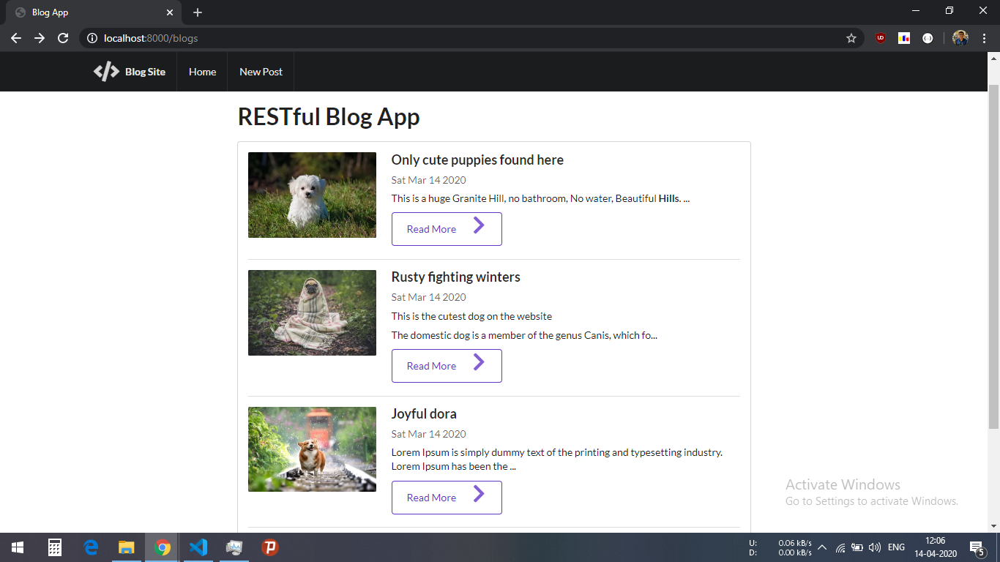
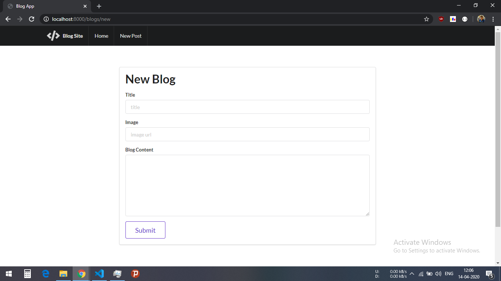
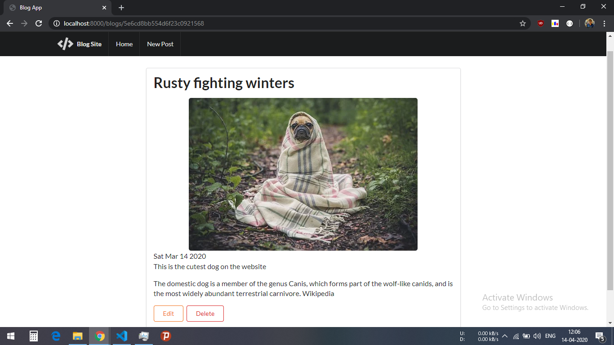

# RESTful-BlogApp

his is a website built on NodeJs,Express with HTML,Jquery,CSS and Semantic UI. To see this website just download or clone this repository and run the local server on port 8000 after installing npm by using command "npm i".

Here are some screenshots of this website :

